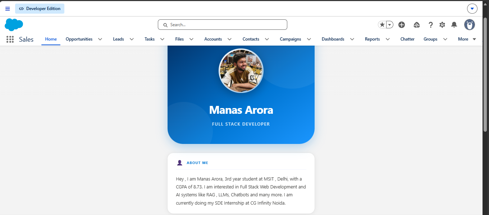
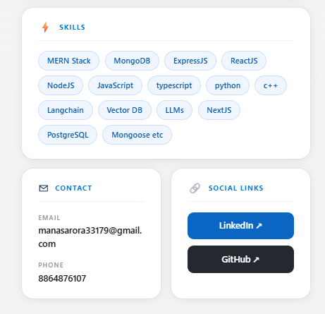

# ⚡ Manas Lightning Portfolio

A personal developer portfolio built as a **Lightning Web Component (LWC)** on the Salesforce Platform. It dynamically fetches and displays profile data from a custom Salesforce object using an Apex controller, and renders it as a polished, responsive card-based UI directly on the Salesforce Home page.

---

## Screenshots





---

## Features

- Dynamic data binding via `@wire` and an Apex controller
- Profile photo, name, and title displayed in a styled hero section
- Skills rendered as individual badge chips (parsed from a comma-separated field)
- Contact info (email & phone) with a clean label/value layout
- LinkedIn and GitHub social links as branded buttons
- Fully responsive card layout with hover effects
- Deployed to a Salesforce Developer Edition org as a Home Page component

---

## Tech Stack

| Layer | Technology |
|---|---|
| UI Framework | Lightning Web Components (LWC) |
| Backend | Apex (`PortfolioController.cls`) |
| Data | Standard `Account` object with custom fields |
| Tooling | Salesforce CLI, VS Code + Salesforce Extension Pack |
| Version Control | Git / GitHub |

---

## Project Structure

```
force-app/main/default/
├── classes/
│   ├── PortfolioController.cls          # Apex controller — queries Account object
│   └── PortfolioController.cls-meta.xml
└── lwc/
    └── portfolioHome/
        ├── portfolioHome.html           # Component template
        ├── portfolioHome.css            # Component styles
        ├── portfolioHome.js             # Component logic + skillsList getter
        └── portfolioHome.js-meta.xml   # Metadata — exposed on Home page
```

---

## Custom Fields on Account

The component reads from the standard **Account** object, extended with these custom fields:

| Field API Name | Type | Description |
|---|---|---|
| `Full_Name__c` | Text | Developer's full name |
| `Professional_Title__c` | Text | Job title / tagline |
| `Profile_Image_URL__c` | URL | Profile photo URL |
| `About_Me__c` | Long Text Area | Bio / about section |
| `Skills__c` | Long Text Area | Comma-separated skill list |
| `Portfolio_Email__c` | Email | Contact email |
| `Portfolio_Phone__c` | Phone | Contact phone number |
| `LinkedIn_URL__c` | URL | LinkedIn profile URL |
| `GitHub_URL__c` | URL | GitHub profile URL |

---

## How It Works

1. The `portfolioHome` LWC uses `@wire(getPortfolioData)` to call the Apex method on load.
2. `PortfolioController.getPortfolioData()` queries the first Account record that has the custom portfolio fields populated.
3. The template conditionally renders using `if:true={portfolio}` once data arrives.
4. The `skillsList` JavaScript getter splits `Skills__c` by comma into an array, which the template loops over to render individual skill badge chips.

---

## Author

**Manas Arora**
3rd Year Student — MSIT, Delhi
SDE Intern @ CG Infinity Noida

[](https://linkedin.com/in/your-profile)
[](https://github.com/your-username)

